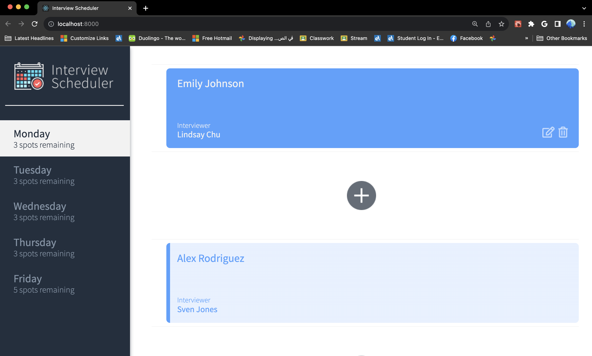
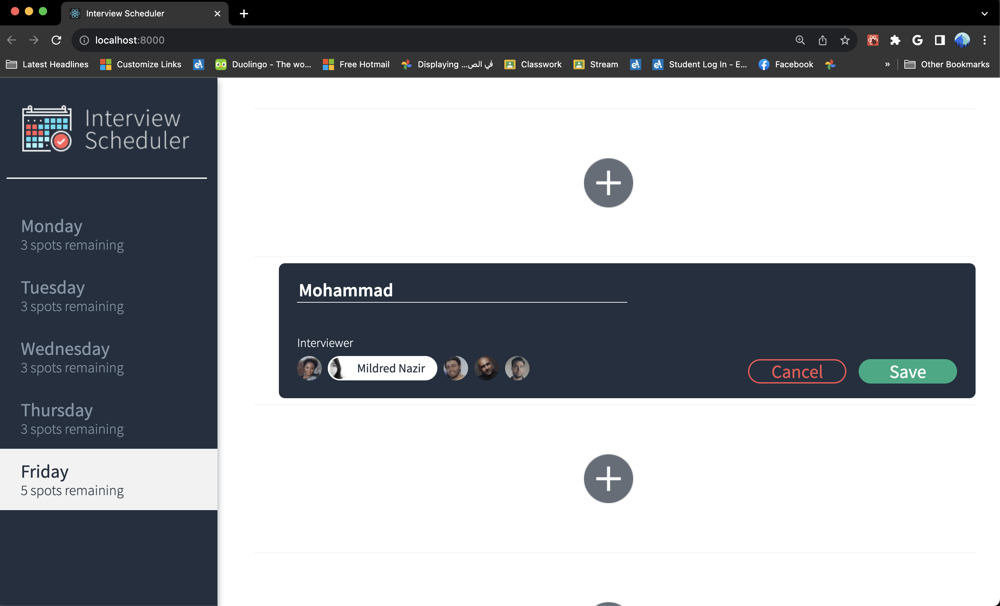
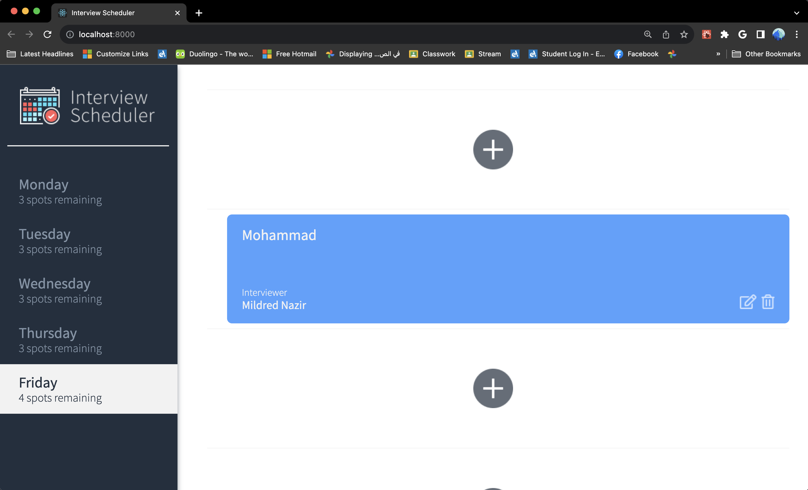
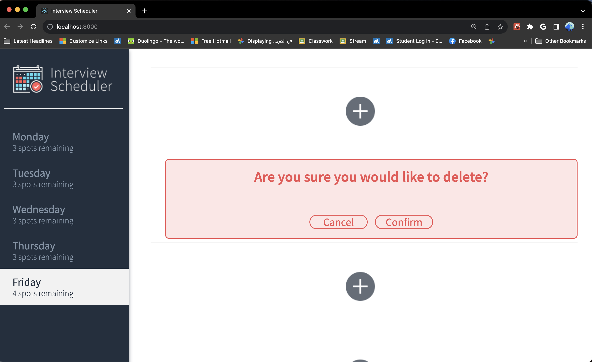

# Interview Scheduler

Welcome to Interview Scheduler! This application allows users to schedule appointments with interviewers. It's built using React and integrates with a backend server.

## Features

- View available interview slots for different days.
- Book appointments by selecting a student name and interviewer.
- Edit or cancel existing appointments.
- Real-time updating of available spots.

## Table of Contents

- [Installation](#installation)
- [Usage](#usage)
- [Technologies Used](#technologies-used)
- [Contributing](#contributing)
- [License](#license)

## Installation

### Database Setup

1. You will need PostgreSQL to use this application; please ensure that it is installed. If not, you can download PostGreSQL [here](https://www.postgresql.org/about/).
2. Start PostgreSQL: `psql` - please note that if you are on WSL, you will need to use the following command first: `startposgresql`.
3. Clone the database repo: `git clone github.com/shovon231/scheduler-api`.
4. Follow the instructions in the packaged README.md file.

### Main App

1. Clone this repo: `git clone github.com/shovon231/scheduler-api`.
   Install dependencies with `npm install`.
2. Run the app using the command `npm start`.
3. Access the app at `http://localhost:8000/`.
4. Should you ever need to reset the database, make a GET request to `http://localhost:8001/api/debug/reset`.

## Usage

### Selecting Days

1. The available days are shown on the left navbar. To add, edit, or delete interviews for a specific day:
2. Click the day you wish to manage interviews for.
3. The day list will also display the number of free spots remaining, which is updated automatically as interviews are added or deleted.

### Adding Interviews

1. To add a new interview:
2. Click the '+' button located in the root directory of the application.
3. Enter the student's name in the provided input field.
4. Select an interviewer from the list of available interviewers.
5. Click the 'Save' button to confirm and save the interview.

### Editing Interviews

1. To edit an existing interview:
2. Hover your mouse over the booked interview you wish to edit.
3. Click the 'Edit' button, which is represented by a pencil-on-paper icon.
4. Modify the student name or select a new interviewer from the list.
5. Click the 'Save' button to apply the changes.

### Deleting Interviews

1. To delete a booked interview:
2. Hover your mouse over the interview you want to delete.
3. Click the 'Delete' button, represented by a garbage can icon.
4. A confirmation prompt will appear.
5. Click the 'Confirm' button to proceed with the deletion.

Please note that the application automatically updates the number of free spots available as interviews are added or deleted. Enjoy managing your interviews seamlessly with Interview Scheduler!

## technologies-used

- axios 0.20.0 or above
- classnames 2.2.6 or above
- normalize.css 8.0.1 or above
- react 16.9.0 or above
- react-dom 16.9.0 or above
- react-scripts 3.4.4. or above

## contributing

Contributions are welcome! If you find a bug or want to add a new feature, feel free to open an issue or submit a pull request.

## license

This project is licensed under the MIT License
